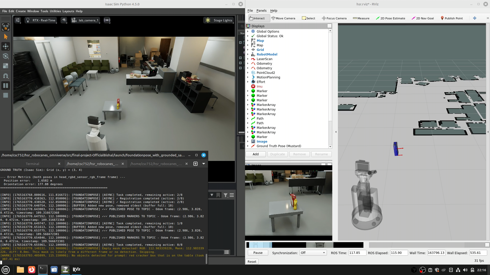
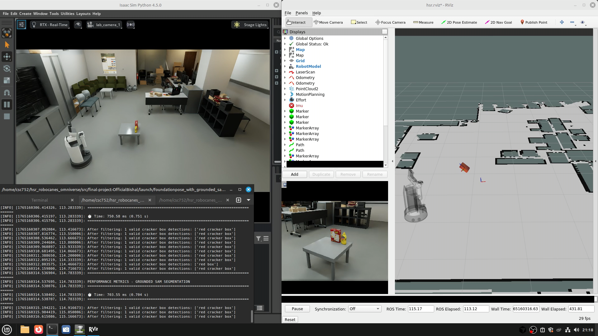
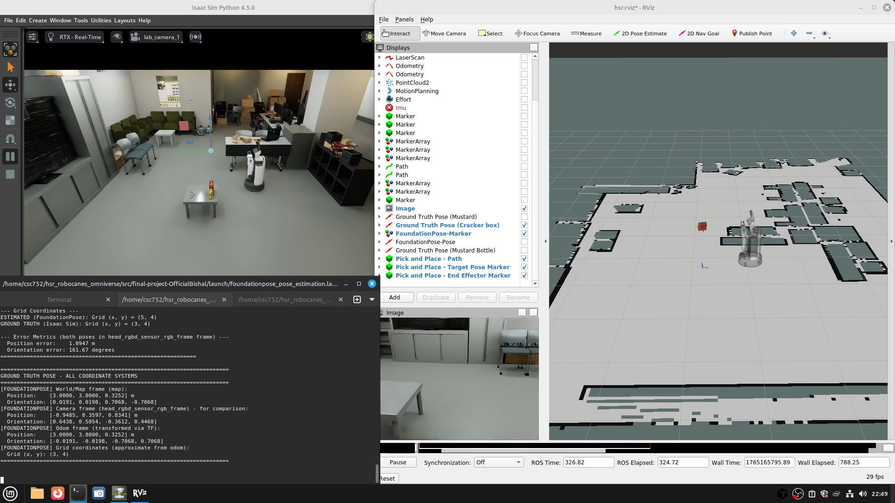

# OFPGS-ROS: Optimized ROS1 Integration for FoundationPose with Grounded SAM

[](http://wiki.ros.org/noetic)
[](https://opensource.org/licenses/MIT)
[](https://www.python.org/downloads/)

**ROS1 integration package** for real-time 6D object pose estimation. Integrates [FoundationPose](https://github.com/NVlabs/FoundationPose) (pose estimation) with [Grounded SAM](https://github.com/IDEA-Research/Grounded-Segment-Anything) (open-vocabulary segmentation) for robotic manipulation tasks. Optimized for Human Support Robot (HSR) with timestamp synchronization and temporal filtering for stable, accurate pose estimation.

> **Note**: This package provides ROS1 integration and optimization. FoundationPose and Grounded SAM are external dependencies developed by their respective authors (see Acknowledgments).

## 🎯 Key Features

This package provides:

- **ROS1 Noetic Integration** - Native ROS1 wrapper for FoundationPose and Grounded SAM
- **Timestamp Synchronization** - Eliminates pose drift on moving robots (30cm → <2cm height error)
- **Temporal Filtering** - Consensus-based pose smoothing for stable trajectories
- **Real-Time Performance** - 1.5-2.5 seconds per pose estimate (8-20x speedup from baseline)
- **High Accuracy** - Median position error <5cm, orientation error <10°
- **Open-Vocabulary Detection** - Integrates Grounded SAM for any object via natural language
- **YOLO+SAM Option** - Fast alternative for COCO dataset objects
- **HSR Optimized** - Designed specifically for Human Support Robot

## 📊 Demo Videos & Results

### Demo Videos

#### Optimized System (Grounded SAM + Timestamp Sync)
<video width="600" controls>
  <source src="recordings/PoseEstimation_with_GroundedSAM_fast.mp4" type="video/mp4">
  Your browser does not support the video tag.
</video>

#### Without Timestamp Synchronization
<video width="600" controls>
  <source src="recordings/PoseEstimation_with_GroundedSAM_issue_fast.mp4" type="video/mp4">
  Your browser does not support the video tag.
</video>

#### Without Segmentation Mask
<video width="600" controls>
  <source src="recordings/PoseEstimation_without_mask_fast.mp4" type="video/mp4">
  Your browser does not support the video tag.
</video>

### Performance Comparison

<p align="center">
  
  
</p>

**Left**: Optimized system with Grounded SAM + timestamp synchronization (height error <2cm)  
**Right**: Without timestamp synchronization (height drift ~30cm)

### System Evolution

<p align="center">
  
  
  
</p>

**Left to Right**: Without segmentation → Without timestamp sync → Optimized system

## 📈 Performance Metrics

| Metric | Value |
|--------|-------|
| **Position Error** | < 5 cm (median) |
| **Orientation Error** | < 10° (median) |
| **Height Error** | < 2 cm (median) |
| **Processing Time** | 1.5-2.5 s/frame |
| **Throughput** | 60-80 poses/min (parallel) |

## 🚀 Quick Start

### Prerequisites

- **ROS1 Noetic** (required)
- NVIDIA GPU with CUDA support
- Conda (Miniconda or Anaconda)
- [FoundationPose](https://github.com/NVlabs/FoundationPose) installed

### Installation

```bash
# Clone into your catkin workspace
cd ~/catkin_ws/src
git clone https://github.com/OfficialBishal/ofpgs_ros.git

# Install dependencies
cd ofpgs_ros

# Option A: Grounded SAM (open-vocabulary, recommended)
./setup/setup_grounded_sam.sh

# Option B: YOLO + SAM (faster, COCO objects only)
./setup/setup_sam.sh

# Build ROS package
cd ~/catkin_ws
catkin_make
source devel/setup.bash
```

### Run

```bash
# Launch with Grounded SAM (open-vocabulary)
roslaunch ofpgs_ros foundationpose_with_grounded_sam.launch

# OR launch with YOLO + SAM (faster)
roslaunch ofpgs_ros foundationpose_with_sam.launch
```

### Verify Output

```bash
# View estimated pose
rostopic echo /foundationpose_pose_estimation/pose

# Visualize in RViz
rviz -d $(rospack find ofpgs_ros)/rviz/hsr.rviz
```

## ⚙️ Configuration

Edit `config/foundationpose_config.yaml`:

```yaml
# Object to detect (Grounded SAM uses this as text prompt)
object_name: "cracker_box"  # or "mustard_bottle", or any custom object

# Mesh file path
mesh_file: "meshes/cracker_box/mesh.obj"

# Grounded SAM parameters (open-vocabulary)
grounded_sam:
  box_threshold: 0.80     # Detection confidence
  text_threshold: 0.80    # Text matching confidence

# FoundationPose parameters
foundationpose:
  est_refine_iter: 1      # Refinement iterations (1-3)
  debug: 0                # Debug level (0-3)
```

## 🔧 Adding Custom Objects

1. **Add mesh file**: Place your object mesh in `meshes/{object_name}/mesh.obj`
2. **Update config**: Set `object_name` in `config/foundationpose_config.yaml`
3. **Run**: Grounded SAM automatically uses the object name as text prompt (e.g., "cracker_box" → "cracker box")

No retraining required! Grounded SAM enables detection of any describable object.

## 📡 ROS Topics

### Subscribed
- `/camera/rgb/image_raw` - RGB image
- `/camera/depth/image_raw` - Depth image  
- `/camera/rgb/camera_info` - Camera intrinsics

### Published
- `~pose` - Estimated 6D pose (`geometry_msgs/PoseStamped`)
- `~markers` - Visualization markers (`visualization_msgs/MarkerArray`)
- `/segmentation/{object_name}_mask` - Segmentation mask

## 🏗️ Architecture

```
RGB-D Image → Grounded SAM (open-vocabulary) → Segmentation Mask
                                                    ↓
                                            FoundationPose → 6D Pose
                                                    ↓
                                            Temporal Filter → Stable Pose
```

**Key Components:**
- **[Grounded SAM](https://github.com/IDEA-Research/Grounded-Segment-Anything)**: Open-vocabulary object detection + segmentation (external dependency)
- **[FoundationPose](https://github.com/NVlabs/FoundationPose)**: Dense RGB-D pose estimation (external dependency)
- **Temporal Filtering** (this package): Consensus-based pose smoothing using SE(3) clustering
- **Timestamp Synchronization** (this package): Accurate poses on moving robots (HSR) - eliminates 30cm drift

## 🆚 Grounded SAM vs YOLO+SAM

| Feature | Grounded SAM | YOLO+SAM |
|---------|--------------|----------|
| **Vocabulary** | Open-vocabulary (any object) | COCO classes only |
| **Speed** | ~680ms | ~370ms |
| **Use Case** | Custom/novel objects | Standard objects |
| **Setup** | Requires PyTorch 1.13.1 | Standard PyTorch |

**Recommendation**: Use Grounded SAM for flexibility, YOLO+SAM for speed.

## 🐛 Troubleshooting

| Issue | Solution |
|-------|----------|
| No pose published | Check mask quality, verify mesh dimensions |
| Import errors | Activate correct conda environment (`conda activate grounded_sam` or `sam`) |
| CUDA out of memory | Use `vit_b` SAM model instead of `vit_h` |
| Pose drift | Timestamp synchronization enabled by default |
| PyTorch version error (Grounded SAM) | Must use PyTorch 1.13.1 |

See `readmes/` for detailed setup guides.

## 📚 Documentation

- [`readmes/README_FOUNDATIONPOSE_SETUP.md`](readmes/README_FOUNDATIONPOSE_SETUP.md) - Complete setup guide
- [`readmes/README_GROUNDED_SAM_SETUP.md`](readmes/README_GROUNDED_SAM_SETUP.md) - Grounded SAM installation
- [`readmes/README_SAM_SETUP.md`](readmes/README_SAM_SETUP.md) - YOLO+SAM installation

## 📄 Research Paper

See [`docs/report/main.pdf`](docs/report/main.pdf) for detailed methodology, experiments, and results.

## 📝 Citation

If you use this package in your research, please cite:

```bibtex
@software{ofpgs_ros,
  author = {Shrestha, Bishal},
  title = {OFPGS-ROS: Optimized ROS1 Integration for FoundationPose with Grounded SAM},
  year = {2024},
  url = {https://github.com/OfficialBishal/ofpgs_ros},
  note = {ROS1 integration package. FoundationPose and Grounded SAM are external dependencies.}
}
```

**Please also cite the original works:**
- FoundationPose: Wen et al., CVPR 2024
- Grounded SAM: IDEA Research
- SAM: Kirillov et al., ICCV 2023

## 🙏 Acknowledgments

This package integrates the following open-source projects (developed by their respective authors):

- **[FoundationPose](https://github.com/NVlabs/FoundationPose)** - Wen et al., CVPR 2024 (6D pose estimation)
- **[Grounded SAM](https://github.com/IDEA-Research/Grounded-Segment-Anything)** - IDEA Research (open-vocabulary segmentation)
- **[Segment Anything (SAM)](https://github.com/facebookresearch/segment-anything)** - Kirillov et al., ICCV 2023 (segmentation)

**This package provides:**
- ROS1 integration and wrapper nodes
- Timestamp synchronization for moving robots
- Temporal filtering and consensus-based pose smoothing
- Performance optimizations (8-20x speedup)
- HSR-specific configuration and testing

## 📜 License

MIT License - see [LICENSE](LICENSE) for details.

---

**Keywords**: ROS1, ROS Noetic, 6D pose estimation, object pose, robotic manipulation, open-vocabulary segmentation, Grounded SAM, FoundationPose, HSR, Human Support Robot, computer vision, robotics, real-time pose estimation
